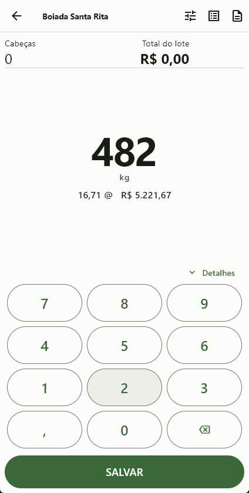
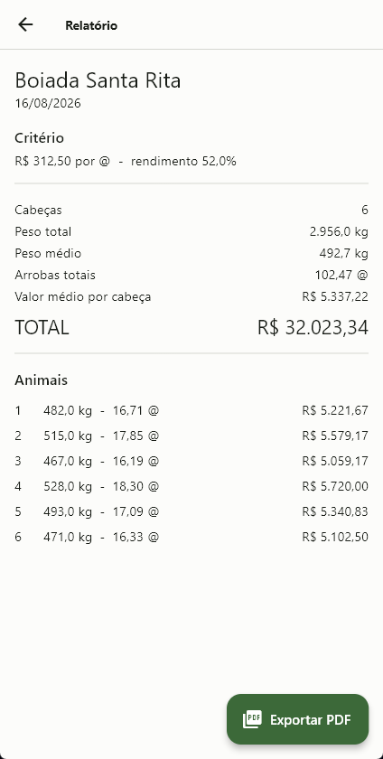
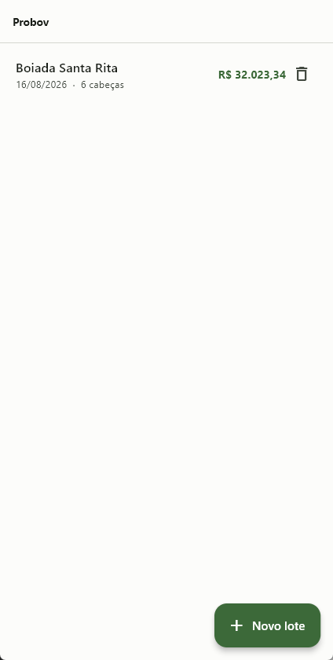
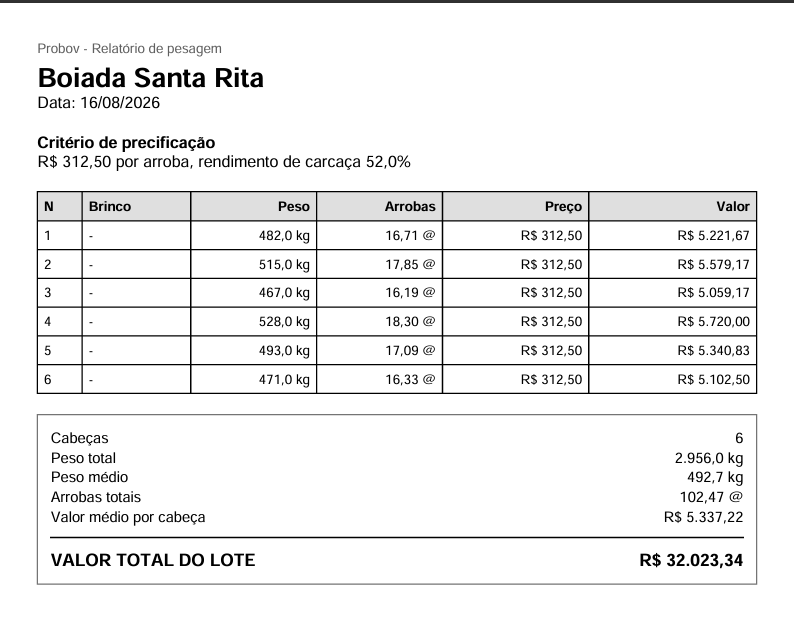

# Probov

App de pesagem e precificação de bovinos. Funciona sem internet, guarda tudo no
aparelho e imprime o relatório do lote em PDF na saída do curral.

<p>
  
  
  
</p>

## O problema

Quem compra e vende gado fecha negócio no curral, com o boi na balança e o
celular sem sinal. A conta é feita na hora: peso, rendimento de carcaça, preço da
arroba, exceção por faixa de peso ou raça. Errar centavo ali, multiplicado por
cabeça, vira prejuízo no fim do dia.

O app faz essa conta durante a pesagem — o valor aparece **antes** de salvar, não
depois — e no fim entrega o documento que fecha o negócio.

## Decisões que sustentam o resto

### Nenhum número passa por ponto flutuante

Dinheiro em centavos, peso em gramas, arroba em centésimos, percentual em basis
points. Toda a aritmética do domínio roda em inteiro e só vira texto na hora de
exibir.

```dart
// lib/core/format.dart — inteiro entra, texto sai
String formatBrl(int centavos)
String formatKg(int pesoG)
String formatArrobas(int centesimos)   // 1664 → 16,64 @
String formatPercentBp(int bp)
```

É o que impede o erro de arredondamento de aparecer três meses depois, quando já
virou divergência de fechamento.

### O relatório é derivado, não salvo

Peso digitado errado é rotina no curral. Ao corrigir, o relatório inteiro se
refaz — totais, médias e valor por lote — porque ele é estado derivado das
pesagens, não uma cópia gravada. Ninguém precisa lembrar de recalcular.

### Offline não é modo, é o padrão

Persistência local em SQLite via Drift, com exclusão em cascata. Não há servidor,
não há sincronização, não há tela de login. O curral não tem sinal.

### O PDF sai do aparelho

Gerado localmente com `pdf` + `printing`, em Helvetica/WinAnsi — que cobre toda a
acentuação do português. A restrição real que isso impõe é não usar travessão
longo nem símbolo tipográfico no layout.

<p></p>

## Como rodar

```bash
flutter pub get
dart run build_runner build --delete-conflicting-outputs   # gera database.g.dart
flutter run
```

Testes:

```bash
flutter test
```

São 64 testes. O domínio é coberto isoladamente — unidades, parsing, precificação
e geração do PDF têm teste próprio — e as telas rodam contra um banco em memória
aberto a cada caso.

## Estrutura

```
lib/
  core/        unidades, parsing e formatação — só funções puras
  domain/      precificação e montagem do relatório, sem Flutter
  data/        schema Drift, repositórios e mappers
  features/    uma pasta por tela
docs/
  superpowers/ a spec e o plano de 16 tarefas que guiaram a implementação
```

O histórico de commits segue a mesma ordem: especificação, plano, e então as
camadas uma a uma.

## Stack

Flutter · Dart · Drift/SQLite · Riverpod · pdf + printing · i18n pt-BR

## Sobre as versões fixadas

O `pubspec.yaml` fixa majors **com o motivo escrito ao lado** — o Riverpod 3 trocou
`ProviderContainer()` por `.test()` e depreciou `maybeWhen`; o `pw.TableHelper`, usado
no PDF, vive na linha `pdf` 3.x. Não é conservadorismo: é para o próximo
desenvolvedor não subir a versão sem saber o que quebra.

## Licença

Sem licença definida — todos os direitos reservados.
